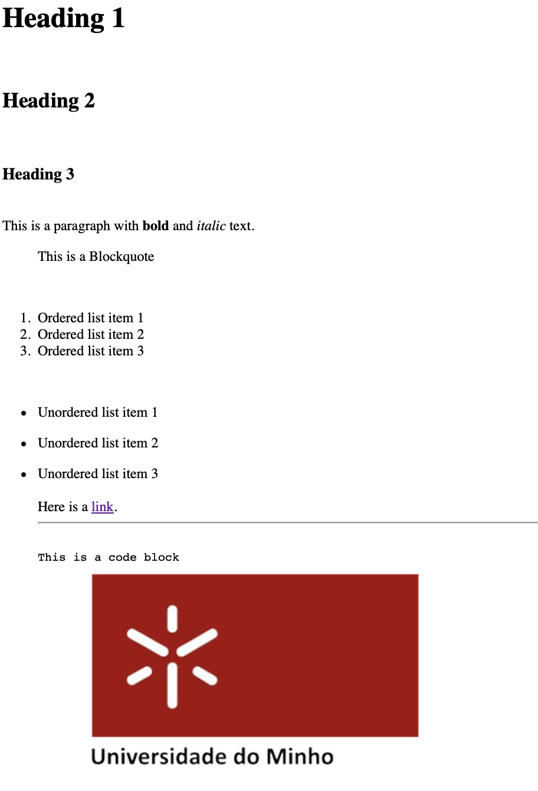

# Manifest TPC2

## Autor: 

**Nome:** Maya Gomes

**ID:** A100822

## Enunciado:

**Objetivo do tpc:** Criar um pequeno conversor de MarkDown para HTML em Python para os elementos descritos na "Basic Syntax".

## Resultados:

